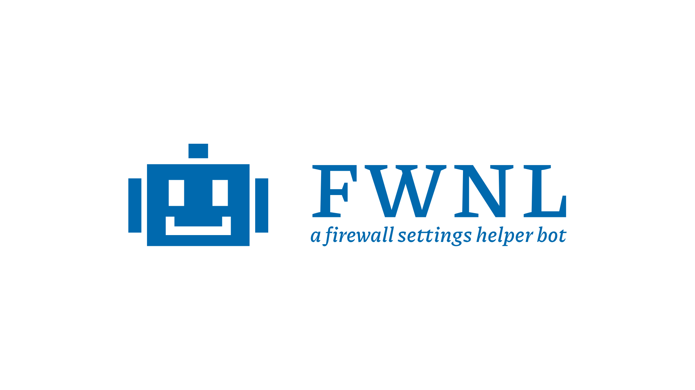

**FWNL** is a firewall configuration bot that generates **FWUnify** compatible settings throught natural-language processing.

## Running locally

### Requirements

Make sure you have the following requirements before running **FWNL** on your machine:

- [Python](https://www.python.org/) >= 3.8.10
- [pipenv](https://pypi.org/project/pipenv/) >= 2022.5.2

### Installing dependencies

Use `pipenv` to install all dependencies (append `-d` if you wish to also build/test the package):

```bash
pipenv install
```

Next, download the `spaCy` models:

```bash
pipenv run spacy download en_core_web_md
```

Now you can already run one of the bot's interfaces (see [caveats](#caveats) for additional info):

```bash
pipenv run fwnl
pipenv run fwnl-web
pipenv run fwnl-telegram
```

To run tests, use `pytest` inside your pipenv:

```bash
pipenv run pytest
```

To build the package, use `build` inside your pipenv:

```bash
pipenv run build
```

## Running in the cloud

If you wish to setup **FWNL** bot in the cloud, follow this steps:

For the Telegram interface, just start `fwnl-telegram` from `nohup`:

```bash
nohup fwnl-telegram -t [your_telegram_bot_token] > tel.out 2> tel.err < /dev/null &
```

For the web interface, first you must make sure you have **[Gunicorn](https://gunicorn.org/)** installed.
Second, edit the `gconfig.py` file so that Gunicorn can find your SSL certificates, or if you'd rather, so that it can run without it.
After that, run it with the provided WSGI and configurations from `nohup`:

```bash
nohup gunicorn -c gconfig.py src.wsgi:web > web.out 2> web.err < /dev/null &
```

## Caveats

As an additional note, if you wish to modify the web interface's `sass` styles you must compile it thereafter. To do so you'll need to install [Dart Sass](https://sass-lang.com/dart-sass), then compile the styles with:

```sh
cd src/interfaces/web/static
sass scss:css -I scss/fontello/css
```
